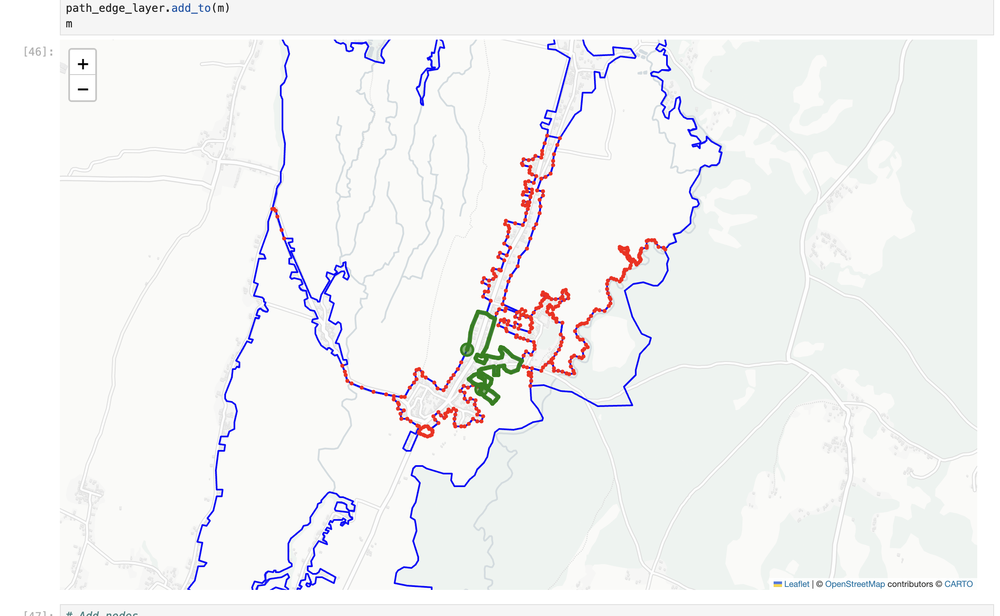
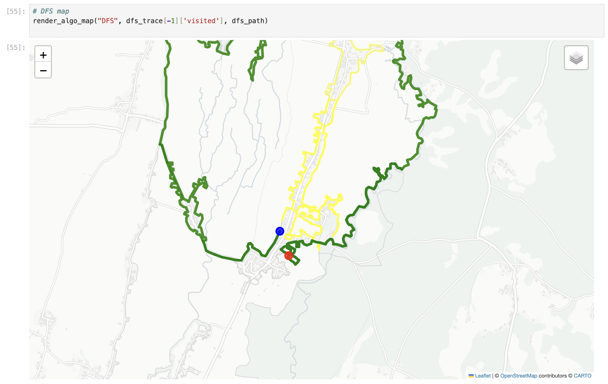
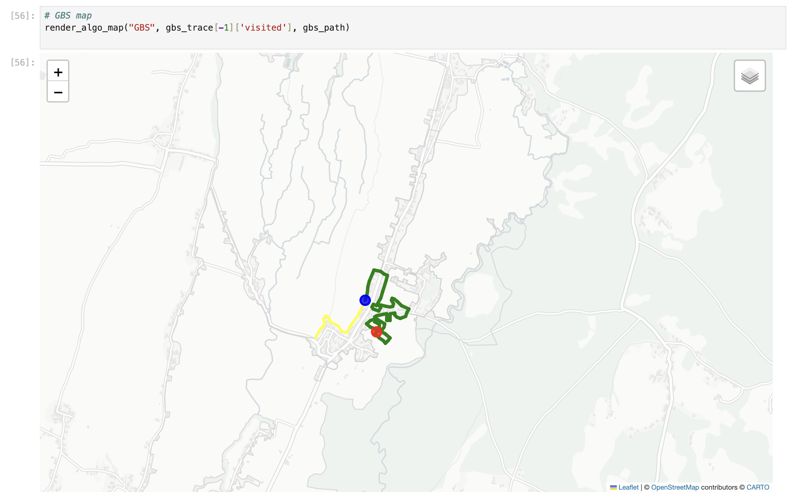

# Hometown Pathfinding on OpenStreetMap: BFS, DFS, GBS, and A\*

## 1. Overview

The goal of this assignment was to extract a real road network for my
hometown from OpenStreetMap (via [extract.bbbike.org](https://extract.bbbike.org/)
and [download.bbbike.org](https://download.bbbike.org/osm/extract/)),
build a graph of it with **OSMnx**, pick a start node near my home and an
arbitrary goal node, then run four classic pathfinding algorithms — BFS,
DFS, Greedy Best-First Search (GBS), and A\* — on that graph. For each
algorithm I measured the number of search iterations, the number of
explored nodes, and the path returned, then argued which one is the best
fit for this problem.

## 2. Data and graph construction

The OSM extract was loaded with `ox.graph_from_xml("./hometown.osm")` into
a MultiDiGraph. Each node carries a latitude (`y`) and longitude (`x`);
each edge carries a `length` attribute in metres that OSMnx computes from
the road geometry. I built a plain dictionary adjacency list
`adj_list = {node: list(G.neighbors(node)) for node in G.nodes()}` so the
algorithms could be written in pure Python without touching the OSMnx
internals. The map was rendered with **Folium** — all edges as a faint
grey background, and the start and goal as coloured markers.

## 3. The four algorithms

**BFS** uses a FIFO queue and treats every edge as one step. It returns
the path with the fewest *hops* but ignores edge length, so it has no
sense of metres.

**BFS map**

**DFS** uses a LIFO stack and dives down one branch before backtracking.
Cheap to code, very memory-light, but it has no goal awareness and tends
to return wildly suboptimal paths on a sparse street grid.

**DFS map**

**GBS** is the first informed search. It expands nodes in order of `h(n)`,
a heuristic estimate of the remaining distance to the goal. I used
**haversine (great-circle) distance** between each node's `(lat, lon)`
and the goal's `(lat, lon)`. GBS is greedy: it always expands the node
that *looks* closest, ignoring how far it has already travelled.

**GBS map**

**A\*** is the second informed search and the one I expected to win. It
orders the queue by `f(n) = g(n) + h(n)`, where `g(n)` is the real road
distance accumulated from the start (summed edge `length` values) and
`h(n)` is again haversine to the goal. Because haversine is *admissible*
on a road network — a road segment is always at least as long as the
straight-line distance between its endpoints — A\* is **provably optimal**
here: the path it returns is guaranteed to be shortest in metres.

**A\* map**

## 4. Evaluation: steps, explored nodes, and complexity

The notebook builds a `pandas` comparison table with four columns:
**iterations** (main-loop runs), **explored nodes** (visited-set size at
goal), **path nodes**, and **path length in metres** (summed edge length
along the returned path). The asymptotic costs are:

| Algorithm | Time | Space | Optimal? | Complete? |
|---|---|---|---|---|
| BFS | O(V + E) | O(V) | Optimal in hops, not metres | Yes |
| DFS | O(V + E) | O(V) | No | Yes (finite graph) |
| GBS | O(bm) worst, fast with a good heuristic | O(bm) | No | Not in general |
| A\* | O(bd) worst, far better in practice | O(bd) | **Yes** with admissible heuristic | Yes |

On the actual hometown extract, BFS and DFS both expand a large,
roughly omnidirectional cloud of nodes around the start because they
have no idea where the goal is. GBS expands the smallest visited set of
all four because the heuristic pulls it almost in a straight line. A\*
expands more nodes than GBS but far fewer than BFS, and crucially its
returned path has the **smallest "Path length (m)"** in the table —
confirming the optimality guarantee empirically.

## 5. Why A\* is the right choice for this problem

The four algorithms answer slightly different questions. BFS answers
"what is the path with the fewest *intersections*?" — rarely what we
want on a road network, since one highway segment counts the same as a
10 m alley. DFS answers "*some* path" — cheapest to code but gives no
quality guarantee. GBS answers "follow the heuristic" — fastest of the
four when the heuristic is well aligned with the true cost, but because
it ignores `g(n)` it can be tricked by a dead-end that *looks* close to
the goal and end up with a longer path in metres than A\*'s.

A\* is the only one that answers the question we actually care about:
"what is the **shortest-distance** path from home to goal?" Because the
haversine heuristic never overestimates a true road distance, A\* is
admissible and returns the optimal path. At the same time the heuristic
prunes huge swaths of the graph that BFS would search blindly, so A\* is
also dramatically cheaper than BFS in practice. **A\* gives BFS-level
correctness with near-GBS-level efficiency** — exactly the trade-off
we want.

## 6. Caveats and conclusion

A\* is optimal here because haversine is admissible *and* consistent on
geographic coordinates. If I had used Euclidean distance on a Mercator
projection without latitude rescaling, the heuristic could overestimate
near the poles and break optimality — heuristic choice is a real design
decision, not a free lunch. I also treated the graph as undirected via
`G.neighbors(u)`; OSM contains one-way streets, and a production router
would need to respect edge direction.

With those caveats, the empirical results back the theory: BFS and DFS
explore too much, DFS gives an obviously bad path, GBS is fast but not
optimal in metres, and **A\* returns the shortest real-distance path
while still exploring far fewer nodes than BFS**. For this hometown
map, A\* is the clear winner.
